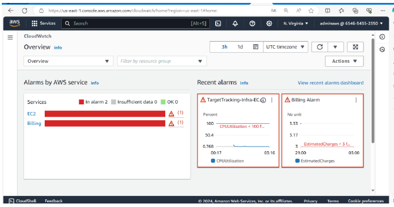
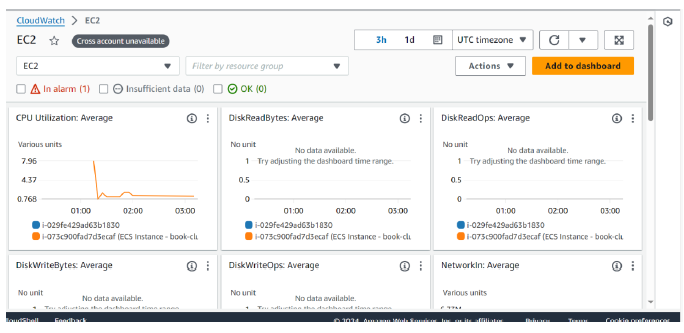

# Proyecto-Bootcamp-librería El mundo de las Letras
** Proyecto final despliegue infraestructura altamente disponible
# *1. Planificación*
# *1.1 Identificar Roles*
## - Administrador de nube y servidores: derechos de administración (acceso a todo AWS).
## - Desarrollador: acceso solamente a AWS Cloud9.
## - Administrador de servidor Web y Base de Datos: full acceso Amazon EC2, RDS y System Manager (parameter Store)
## - Equipo de soporte de Almacenamiento: puede ver solamente los buckets creados en S3.
## - Auditor - Accesos: Accesos de solo lectura Amazon EC2, RDS, IAM.
## - Usuario de Consulta: Accesos de solo lectura Amazon EC2, RDS.
# *1.2 Diagrama de Gantt

# 1.3* Requerimientos
## - Requerimiento 1 
# Desarrollar la plataforma web que permita a los clientes explorar los diferentes libros.
## - Requerimiento 2
# Implementar la red en la nube de AWS con 6 subredes: dos públicas y cuatro privadas. Para garantizar Alta disponibilidad, se usaran dos zonas de disponibilidad (zona A y zona B).
## - Requerimiento 3
# La subred pública actuará como la puerta de entrada a la plataforma en línea, brindando a los usuarios acceso a internet y una experiencia de navegación
# fluida a traves del balanceador de carga. Se usara un auto scaling para redirigir volumen de tráfico creando nuevas instancias que permitan mantener equilibrado ese tráfico.
## - Requerimiento 4
# Las subredes privadas  estarán protegidas contra accesos no autorizados desde internet garantizando la seguridad de los datos sensibles de la librería.
## - Requerimiento 5
# La instancia EC2 debe poder conectarse a la base de datos en la subred privada. Para facilitar la conexión se implementarán parámetros de configuración de la base de datos RDS en el AWS System Manager Parameter Store,
# garantizando acceso seguro y eficiente a los datos almacenados.
## - Requerimiento 7
# Se debe garantizar consultas al modulo de calificaciones y contactenos dentro de la pagina del cliente.
# - Requerimientos No funcionales
## - Requerimiento 8
# El Framework usado para la pagina web esta flask y el motor de la Base de Datos se encuentra en MariaBD.
# El despliegue por codigo ha sido diseñado en Python
# Se aplican pruebas de stress y de carga. Adicionalmente se asigna al usuario solicitante un acceso para ingresar y validar la funcionalidad de la pagina.
# Se ejecutan pruebas de escalabilidad, y HA para comprobar alta disponibilidad. 
# Legislaciones de Derechos de Autor (recomendacion al usuario solicitante para evitar incurrir en posibles amonestaciones de ley).
## 1.4* Arquitectura
### Este es el diagrama de arquitectura para una infraestructura altamente disponible en una libreria.

# Ejecucion

### Para automatizar el despliegue de la infraestructura de la plataforma online de la librería, se decidió utilizar el servicio AWS Cloudformation. Para tal efecto se creó un repositorio en donde se almacenaron los dos templates: network.yml y application.yml y ### mediante el servicio de Codepipeline se tomó como source el repositorio en Codecommit, se hizo la configuración para automatizar el despliegue de la capa de red y de la capa de aplicación. Para ello se configuró el pipeline determinando el archivo que se va ### a lanzar que es el network.yml y después se ejecutó el mismo proceso con el script el application.yml y así se automatizó el despliegue de la infraestructura.

## Se utilizó el servicio de cloudoformation que es un servicio de infraestructura como código para realizar el despliegue de la arquitectura. Utilizamos el siguiente comando para realizar el despliegue de la arquitectura:
## Realizar la validacion de los template network.yml
### aws cloudformation validate-template --template-body file://network.yml
### aws cloudformation create-stack --stack-name network-stack --template-body file://network.yml
## Crear VPC
### CIDR: 172.16.0.0/16
## Crear 6 subredes en dos zonas de disponibilidad diferentes:
### PublicSubnetA: 172.16.1.0/24 - Availability Zone A
### PublicSubnetB: 172.16.2.0/24 - Availability Zone B
### PrivateSubnetA: 172.16.3.0/24-Availability Zone A
### PrivateSubnetB: 172.16.4.0/24 - Availability Zone B
### PrivateSubnetAA: 172.16.5.0/24-Availability Zone A
### PrivateSubnetBB: 172.16.6.0/24 - Availability Zone B
## Crear Route Table
### Asociar con las dos subredes públicas
## Crear ruta para salida a internet
## Crear dos NatGateway
### Uno se crea en la PublicSubnetA
### El otro se crea en la PublicSubnetB
## Asociar cada NatGateway con una PrivateSubnet
## Crear las rutas para salida a internet.
## Crear grupos de seguridad:
### Grupo para la instancia en la subred publica
### Grupo para la instancia en la subred privada
### Grupo para la base de datos
### Grupo de seguridad para el balanceador de cargas
## Crear Roles IAM con los siguientes permisos:
###  S3FullAccess
###  SSMFullAccess
###  Asociar Rol a instancia EC2
## Crear Internet Gateway
## Conectar con la VPC creada.
## Asociar dos subredes públicas.
## Crear los parametros de conexión a la base de datos en System Manager-Parameter Store
## Crear instancia en una subred pública con el siguiente User Data:
#!/bin/bash
sudo dnf install -y python3.9-pip
pip install virtualenv
sudo dnf install -y mariadb105-server
sudo service mariadb start
sudo chkconfig mariadb on
pip install flask
pip install mysql-connector-python

High Available and High Scaling 2

pip install boto3
wget https://jav-bucket-web.s3.amazonaws.com/python-db-ssm.zip
wget https://jav-bucket-web.s3.amazonaws.com/databases.zip
sudo unzip python-db-ssm.zip
sudo unzip databases.zip
sudo mv python-db-ssm databases /home/ec2-user

## Ingresar a la instancia y crear el siguiente archivo en la ruta /etc/systemd/system/myapp.service

sudo nano /etc/systemd/system/myapp.service
[Unit]
Description=My Flask Application
[Service]
User=ec2-user
WorkingDirectory=/home/ec2-user/python-db-ssm
ExecStart=/usr/bin/python3 /home/ec2-user/python-db-ssm/app.py
Restart=always
[Install]
WantedBy=multi-user.target
## Recarga el demonio para que reconozca los cambios realizados:
### sudo systemctl daemon-reload
## Inicie el servicio:
sudo systemctl start myapp
## Habilitar el servicio para que inicie cuando arranque la máquina
sudo systemctl enable myapp
## Se crea la base de datos en RDS:
## Se hace la migración de la base de datos
## Se crea una Image (AMI) desde la instancia EC2 creada en la subred pública.
## Se crea un Launch Template desde la AMI creada en el paso anterior.
## No escoger VPC. Se determina en la configuración del Auto Scaling Group
## Asignar rol.
## Crear key pair: PEM *el key pair es propio de cada recurso*
## Crear Auto Scaling Group a partir del Launch Template creado en el paso anterior.
## No seleccionar Load Balancer. Se creará después.
## Seleccionar Subredes privadas donde se van a lanzar las instancias.
## Crear Load Balancer:
## Escoger Application Load Balancer
## VPC y las subredes públicas.
## Crear Target group:
## Definir puerto 5000
## Asociar Load Balancer con Auto Scaling Group.
## Para definir el Health Check:
### Desde la aplicación agregar lo siguiente:
@app.route('/health')
def health():
return jsonify('Ok'),200
## Crear base de datos:
## Crear SubnetGroup y asociar a la base de datos.
## Probar el servicio
## Se debe reiniciar el servidor que correo el servidor web en segundo plano. Para ello se utiliza el servicio
### System Manager:
## Se debe crear un rol para EC2 con el siguiente permiso:
### AmazonEC2RoleForSSM
## Asociar Rol a las instancias
### Desde las instancias puede revisar estado del servicio System Manager Agent usando:
sudo yum install -y amazon-ssm-agent
sudo systemctl status amazon-ssm-agent
## Ir al servicio System Manager:
## Seleccionar Fleet Manager
## Seleccionar el ID de las instancias.
## En Node Actions, escoger Execute run Command
## En la barra de búsquedas seleccionar: AWS-UpdateSSMAgent
## Seleccionar instancias y darle ejecutar.
## En la barra de búsqueda se puede seleccionar: AWS-RunShellScript
## Se puede escribir los comandos a ejecutar en las instancias.
****
## Segmentamos el codigo por servicio o según se requiera:
Application.yml
Network.yml
## Creamos un repositorio para desplegar la infraestructura
$ aws codecommit create-repository --repository-name infraestructura-aws --repository-description "crear infraestructura en aws"

### Se listan los repositorios
$ aws codecommit list-repositories

## Consultamos el repositorio
aws codecommit get-repository --repository-name infraestructura-aws
# Se realiza un git clone del repositorio que acabamos de crear
git clone https://git-codecommit.us-east-1.amazonaws.com/v1/repos/infraestructura-aws
### Creamos el pipeline
## Extraemos los archivos network.yml y application.yml y revisamos que se encuentren cargados en el repositorio de infraestructura-aws
## Y se ejecuta el despliegue con el comando
python3 app.py
## Ahora podemos observar los recursos desplegados de forma correcta en AWS Cloudformation.

# Seguimiento y Control
## AWS Well-Architected 
### Ayuda a los arquitectos de la nube a crear una infraestructura segura, de alto rendimiento, resistente y eficiente para una variedad de aplicaciones y cargas de trabajo. Este marco, creado en torno a seis pilares (excelencia operativa, seguridad, fiabilidad, ### eficiencia de rendimiento, optimización de costos y sostenibilidad), ofrece un enfoque coherente para que los clientes y los socios evalúen las arquitecturas e implementen diseños escalables.

## Recomendaciones en la entrega del proyecto
# Todos los requerimientos mencionados en el documento, son entregados a conformidad del solicitante. Cualquier tipo 
# de Cambio fuera de los requerimientos establecidos seran evaluados y presupuestados en un proyecto nuevo. El
# Soporte tendrá como alcance unicamente los recursos desplegados durante el desarrollo del proyecto y no seran incluidos nuevos requerimientos.
